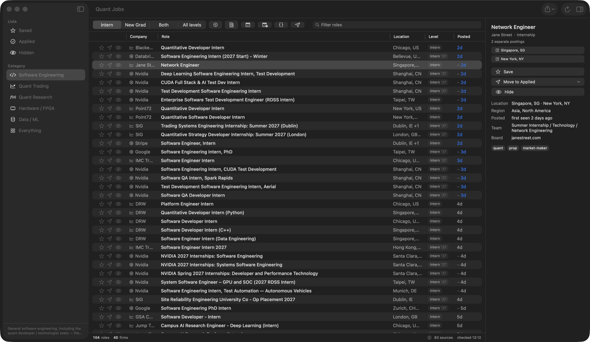
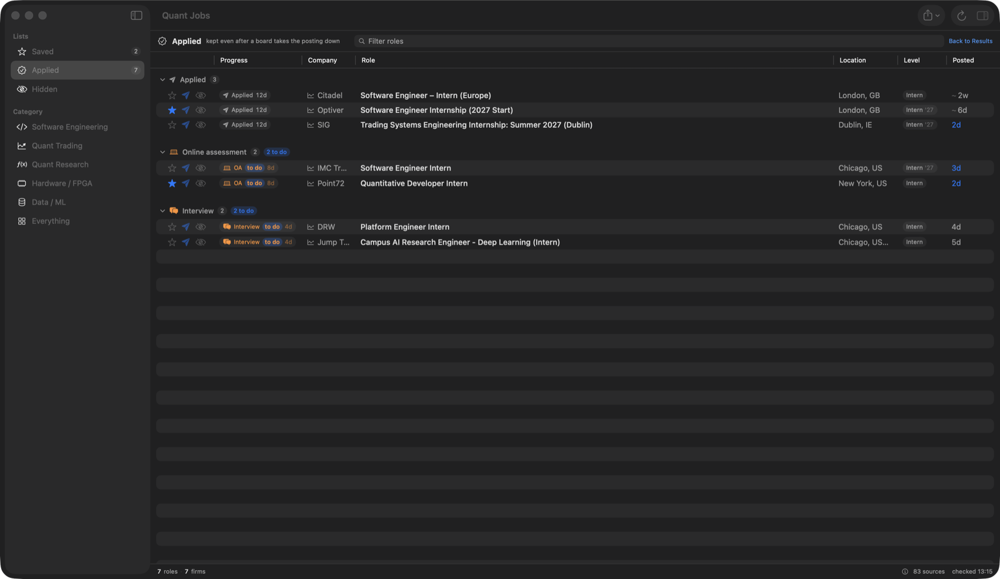
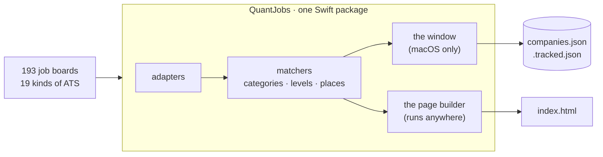
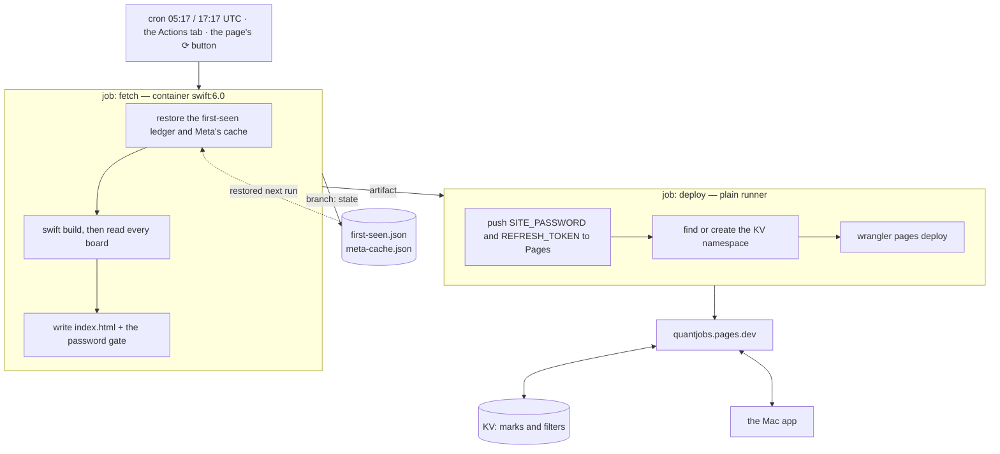

# quantjobs

Finds internship and new-grad postings by reading firms' job boards directly — 193
of them, quant shops and big tech — and keeps track of what you have applied to.
A native Mac app plus a page you can read on your phone. No account, no server of
your own, nothing sent anywhere.



Every posting comes from the firm's own board, so a role appears here when it
appears there rather than whenever an aggregator gets round to it. Dead links are
dropped before you see them, and a role posted in eight cities is one row.

## What it is for

Applying is a tracking problem as much as a searching one, so the same window does
both. Mark a role applied and it moves into a pipeline — assessment, interview,
final, offer, rejected — that survives the firm taking the posting down.



An online assessment you have been *given* is not one you have *sat*, so those are
two dates on one step, and anything still owed is badged **to do**.

## How it fits together

One Swift package. The window and the page builder share every adapter, matcher and
filter — the page is not a second implementation that has to be kept in step.



`--check` runs the whole pipeline in a terminal, which is how the boards are tested
without a UI. See [INTERNALS.md](INTERNALS.md).

## Install

Two ways in, and they are independent — take either one.

### Download it

[QuantJobs.dmg][dmg] (macOS 14+): drag it onto Applications. Nothing else to
fetch — the app carries its own copy of the firm list.

The first launch takes one extra step, because the app is not notarised (that needs
a paid Apple developer account). macOS offers only *Move to Trash* or *Done*:

1. Click **Done** — not Move to Trash.
2. **System Settings ▸ Privacy & Security**, scroll to **Security**. There is a line
   saying QuantJobs was blocked, with **Open Anyway**.
3. Click it and authenticate. You are never asked again.

[dmg]: https://github.com/mgman03/quantjobs/releases/latest/download/QuantJobs.dmg

### Or build it

Needs the Xcode command-line tools, and skips the step above entirely — an app you
built yourself is not quarantined, so Gatekeeper leaves it alone.

```bash
cd QuantJobsApp
./make-app.sh          # build, install to /Applications, add the `quantjobs` command
```

`./make-app.sh --dmg` builds a disk image instead of installing, for handing to
someone else. It is not part of installing it here.

### The `quantjobs` command

The binary lives inside the bundle at
`/Applications/QuantJobs.app/Contents/MacOS/QuantJobs`, which is on nobody's PATH.
`make-app.sh` drops a wrapper called `quantjobs` into the first of `~/.local/bin`
or `/usr/local/bin` that already is, which is what makes the `quantjobs …` lines
below typeable.

**The disk image does not do this** — it contains the app and nothing else. If you
installed that way and want the command:

```bash
mkdir -p ~/.local/bin
printf '#!/bin/sh\nexec "/Applications/QuantJobs.app/Contents/MacOS/QuantJobs" "$@"\n' \
  > ~/.local/bin/quantjobs && chmod +x ~/.local/bin/quantjobs
```

Or just use the full path. Nothing needs the command except the checks and the sync
setup; the window does not.

**Keep the checkout out of `~/Desktop`, `~/Documents` and `~/Downloads`.** macOS
gates those three, so an app reading its config from one asks permission on every
rebuild.

## The page on your phone

The same scraper runs on GitHub's runners twice a day, builds one self-contained
HTML page with every filter the app has, and publishes it to Cloudflare Pages. Free
at every step, and it keeps working with the Mac shut.

**It is your page, not a service.** There is no login because there are no accounts:
the deploy publishes to a Cloudflare project in your own account, and the URL below
is the one this repository's owner happens to have. `*.pages.dev` names are globally
unique, so a second person cannot deploy to it even by accident — theirs is
`something-else.pages.dev`, holding their postings and their marks, reachable with
their password. Nothing is shared between two people running this, in either
direction.

Three things name this repository, and a fork should change them: the project name
in `.github/workflows/fetch.yml`, `Updater.repo` (which decides whose releases the
app offers you), and `SharedLedger.url` (whose first-seen dates it reads). The
worker learns its own repository from the deploy, so the ⟳ button follows the fork
without being told.



Turning it on takes three secrets in **Settings ▸ Secrets and variables ▸ Actions**:

| secret | what it is |
| --- | --- |
| `CLOUDFLARE_API_TOKEN` | My Profile ▸ API Tokens, with *Cloudflare Pages: Edit* and *Workers KV Storage: Edit* |
| `CLOUDFLARE_ACCOUNT_ID` | the id in the dashboard URL |
| `SITE_PASSWORD` | whatever you want the page to ask for |
| `REFRESH_TOKEN` | optional — a fine-grained PAT with *Actions: read and write*, which is what makes the page's ⟳ button work |

The page lists what you applied to and were turned down for, so it is not published
open. `site/_worker.js` asks for `SITE_PASSWORD` over HTTP Basic auth — the
browser's own prompt, which Safari saves to the keychain. Deliberately **not** the
Pages "Access policy" toggle: that covers preview deployments only and leaves the
real URL open.

**Marks and filters sync both ways.** Star a role on the train and it is starred in
the app. Conflicts resolve per posting by whichever side was edited last, except an
application's steps, which are merged — the Mac holding "applied 3 June, OA 20 June"
and the phone adding an interview ends with three steps, not with whichever was
touched last.

On the Mac, once:

```sh
quantjobs --check --sync-setup https://<your-project>.pages.dev   # asks for the password
quantjobs --check --sync                                     # what the phone knows
```

That writes `.sync.json`, `chmod 600`, gitignored. The app syncs on launch, two
seconds after any mark, and on ⇧⌘S.

The page is built for a thumb: 44px targets, nothing focusable under 16px (Safari
zooms in on a smaller field and does not zoom back out), a header that folds while
you scroll, and six seconds to undo a mis-tap.

## Which firms are wired up

193 board entries across 187 firms, read through 19 kinds of source. Most are
ordinary ATS boards — Greenhouse, Lever, Ashby, Workday, SmartRecruiters, Oracle
Cloud, Eightfold, Jibe. The rest needed adapters of their own:

| firm | why |
| --- | --- |
| Jane Street | its Greenhouse board is experienced hires only; students come from the JSON its own site reads |
| Meta | metacareers.com refuses anything without `Sec-Fetch-*` headers; behind that, a sitemap and a `JobPosting` on each page |
| Stripe | Greenhouse keeps answering for roles Stripe has taken down, so it is cross-checked against stripe.com |
| Google, Apple | read from their own careers sites |
| D. E. Shaw, G-Research | no ATS at all; one hydrates a Next.js payload, the other server-renders its cards |
| Citadel, Optiver, Two Sigma | own careers platforms |
| Hudson River Trading, Marshall Wace, Plaid | read from their sitemaps |

**Nine firms have nothing readable**, and each carries a dated `note` in
`companies.json` saying what was tried: Goldman Sachs and Cisco render everything
client-side and hide the endpoint; Tesla, Bloomberg and Microsoft answer 403 to
scripted callers; Bridgewater, ExodusPoint and Quantlab publish no listings at all.

`enabled` is your Firms selection, not a shipped default — the app writes it back to
the same file.

## Configuring

`companies.json` is the firm list:

```json
{ "name": "Jump Trading", "ats": "greenhouse", "token": "jumptrading",
  "enabled": true, "tags": ["hft", "prop"], "tier": 1, "segment": "Tier 1" }
```

- **`ats`** — which adapter. Most take a `token`; Workday and Oracle take a host and
  a site. See [INTERNALS.md](INTERNALS.md#board-adapters).
- **`tags`** — `quant` and `bigtech` decide which half of the Firms picker a firm
  lands in; the rest are descriptive.
- **`tier`** / **`segment`** — how the picker groups them. Judgement calls, so edit
  them freely.
- **`query`** — narrows a board server-side. Worth setting on a big tenant: JPMorgan
  posts 7,388 roles, and `internship` cuts that to 338 without losing a programme.

`categories.json` decides what counts as software, quant trading, quant research and
so on; `locations.json` is the gazetteer that makes `US, CA, Santa Clara` and
`Santa Clara, California, United States` the same place.

## Updating

The app asks GitHub on every launch whether there is a newer release. If there is, a
bar appears with the version, what changed, and an Update button — it downloads the
disk image, checks it really is QuantJobs and really is newer, swaps itself out and
relaunches. Nothing is installed without you clicking Update, and the check is one
unauthenticated GET.

Updating this way skips the Gatekeeper prompt a manual download triggers, because
quarantine is applied by browsers rather than by the network.

Your saved and applied roles, settings and on/off choices live outside the app and
are kept. The firm list is refreshed on first launch: firms added since your version
arrive, and firms you switched on or off stay how you left them.

## Notes

- **First-seen dates are shared, not per-machine.** A posting with no date from its
  board shows when the *tracker* first saw it, from a ledger the scheduled fetch
  keeps on the repository's `state` branch. Without it, a rebuild that starts from
  nothing calls every undated posting "found today", twice a day, for ever.
- `.tracked.json` holds what you have saved, applied to or hidden, and the timeline
  for each. It survives a board deleting the posting.
- Boards are fetched concurrently with retries; a firm that fails is reported in the
  status bar and never takes the run down.
- Nothing is authenticated — these are the same public endpoints the firms' own
  careers pages call.
- A full run is about 23 seconds for 193 boards. `quantjobs --check --timing` prints
  where it goes.

## More

[INTERNALS.md](INTERNALS.md) — the adapters, the matchers, the checks, and how to
add a board.

## Author

Mykhaylo Gershman · [github.com/mgman03](https://github.com/mgman03)
